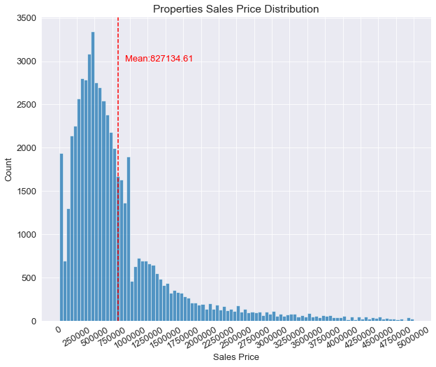
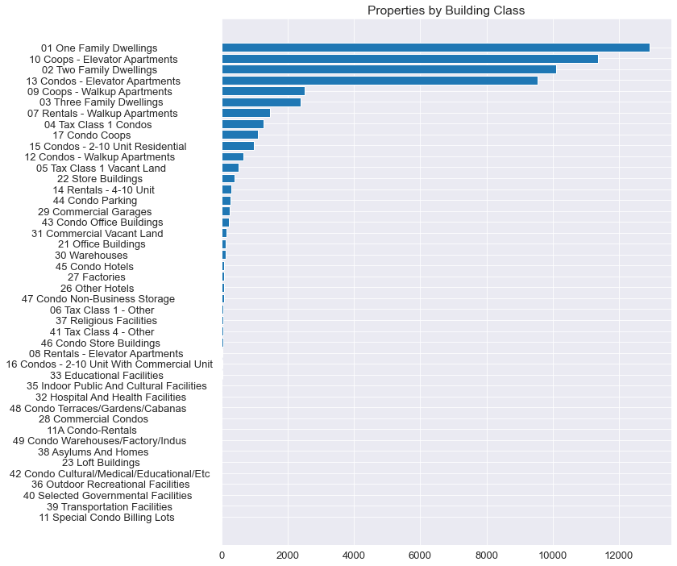
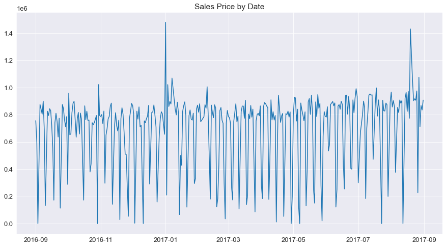
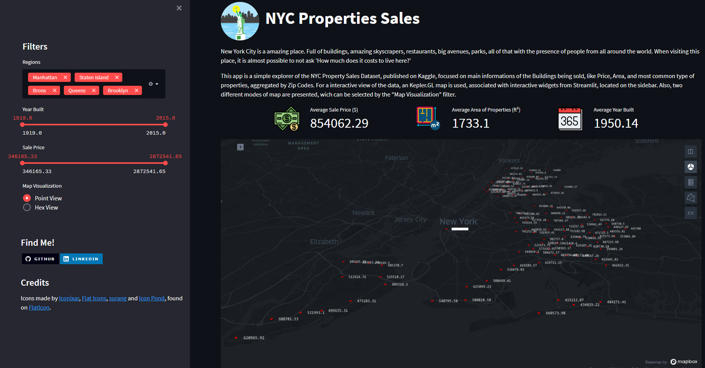

# NYC Property Sales Analysis

## 1. Introduction

Some years ago, I had the opportunity to visit New York in one of my vacations, and I got really amazed by how places were so different from anything I had seen before. All the streets, parks, skyscrapers, stores and restaurants seems to compose the uniqueness of the City that never Sleeps. So, wandering a little bit on the streets was enough to ask myself how much does it cost to live in a place like that. 

Specially considering the well-known high density of buildings on the city, we may expect find interesting things by first analysing the sales prices of properties on New York. That's the purpose of this project. Here, a 12-month Kaggle dataset of Property Sales (found [here](https://www.kaggle.com/new-york-city/nyc-property-sales)) is analysed, involving the following features:

* Location Features: Borough, Neighborhood, Block, Lot, Address, Zip Code and Geographical Coordinates;
* Class and Category of the Building;
* Physical Properties of the Building: Year Built, Land and Gross Square Feet, Residential and Comercial Units;
* Sales Information: Sales Price and Sales Date.

## 2. Proposed Project
Since the idea behind this project is mostly analytical, the proposed project consists mainly on the use of graphical tools to analyze and understand the data in more details. In terms of development, two main products are constructed on this project:

* An Exploratory Data Analysis Notebook, where the data is deeply analyzed and some questions about the behaviour of the Price of Properties in face of some other variables are answered.
* An Interactive App developed with Streamlit, where the variatons of Properties Prices can be analyzed spatially with the help of a 3D Map and some interactive filters. 

## 3. Exploratory Analysis
To explore the data, a Jupyter Notebook containg some interesting charts were created. From that, some cool insights, could be obtained:

* The distribution of Sales Price in New York presents a very long-tail, which means that a lot of very expensive properties can be found on the city.
  
  

* Apartments and Dwellings consists on the most popular types of properties on the city.
  
  

* Sales Prices have a strong weekly seasonality aspect, where the prices of closed sales, on average, drop a lot on weekend days. 

  

## 4. Streamlit App
Together with the Notebook, a Streamlit App is proposed in a way to analyze the variations of price with different locations of the city in a more interactive way. The app can be acessed [here](https://nyc-property-sales.streamlit.app/).

## 5. Conclusions
Certainly, living in New York City appears quite expensive, which is not impressive given the global importance of the city and the fact that it is the most populous city in the United States.

The data involved on this project is very rich in details, and some interesting analysis and charts could be obtained from it, generating useful insights that could be valuable in a Housing Market context.

## 6. Next Steps
Future Steps for this project could involve:
* More detailed Geocoding process, using the entire address to obtain more precise locations.
* Develop a Machine Learning Model to price properties according to it's main characteristics.

 
